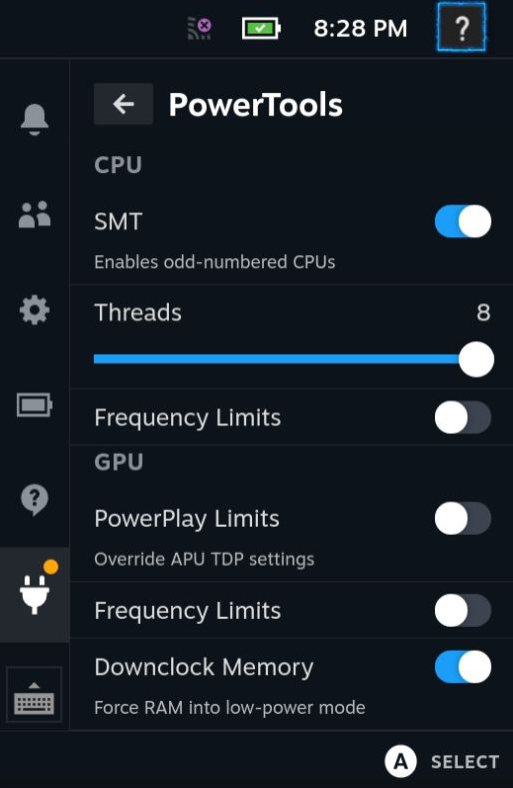

# PowerTools

Steam Deck power tweaks for power users.

This is generated from the template plugin for the [Decky Plugin Loader](https://github.com/SteamDeckHomebrew/decky-loader).
You will need that installed for this plugin to work.

## What does it do?

- Enable & disable CPU threads & SMT
- Set CPU frequencies
- Set GPU frequencies and power (fastPPT & slowPPT)
- Cap battery charge rate (when awake)
- Display supplementary battery info
- Keep settings between restarts (stored in `~/.config/powertools/<gameId>.json`)

## Install

Please use Decky's [built-in store](https://beta.deckbrew.xyz/) to install official releases.
If you're an advanced user, and/or would like to use an in-development version, feel free to build PowerTools yourself.

## Build

0. Requirements: a functioning Rust toolchain for x86_64-unknown-linux-musl, npm, and some tech literacy
1. In a terminal, navigate to the backend directory of this project and run `./build.sh`
2. In the root of this project, run `npm run build`
3. Transfer the project (especially dist/ and bin/) to a folder in your Steam Deck's homebrew plugins directory

## License

This is licensed under GNU GPLv3.
